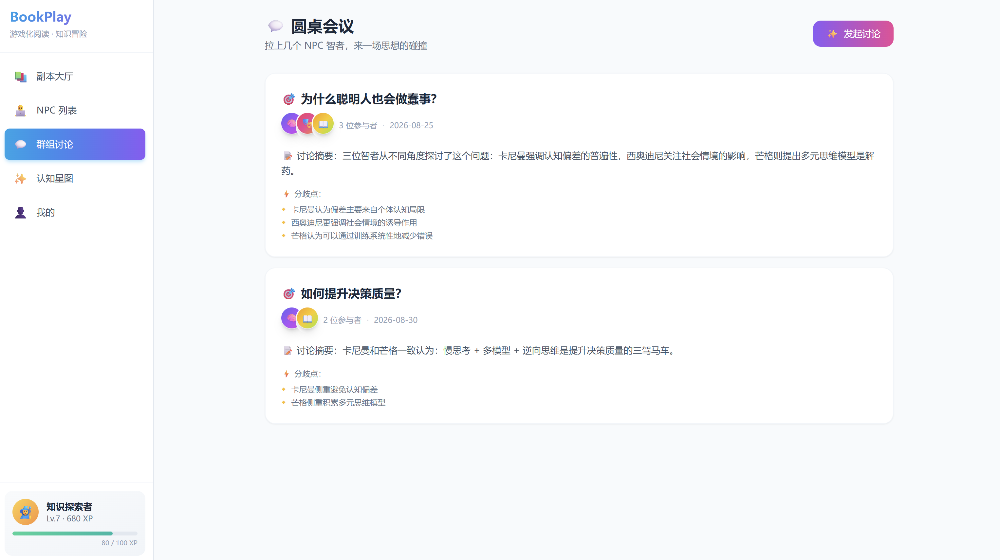
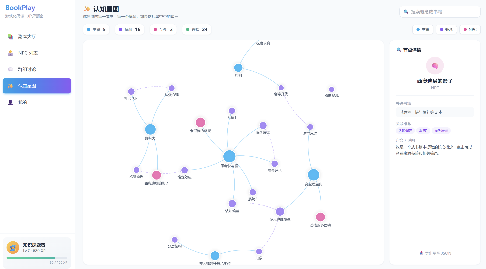
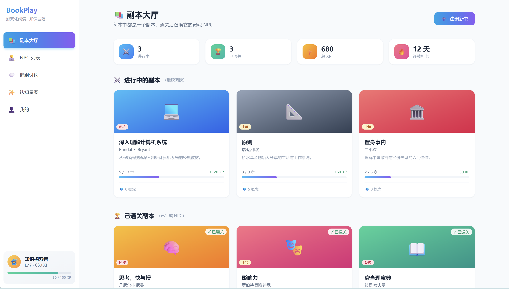
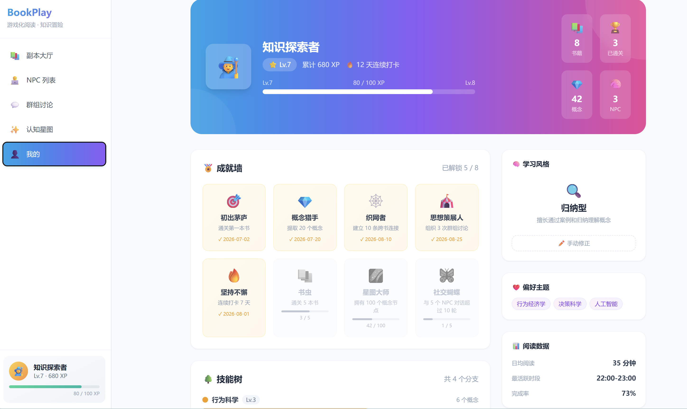

# BookPlay

**通过做决定来学习的沉浸式知识引擎**

BookPlay 不是把书"拆成知识点"，而是把书的核心认知转化为玩家必须亲身面对的情境。玩家通过做选择来学习——不是"记住"，而是"经历"。

[](https://react.dev/)
[](https://vitejs.dev/)
[](https://tailwindcss.com/)

---

## 🎯 核心理念

> "学习不是灌输，而是在情境中做选择，然后看见后果。"

| 原则 | 说明 |
|:---|:---|
| **先体验，后命名** | 玩家先做选择，然后才知道"你刚才用了 XX 原理" |
| **选择必须有代价** | 每个选项都有真实的代价，没有完美答案 |
| **反馈塑造身份** | 反馈不是"对/错"，而是"你是一个什么样的人" |

---

## 🎮 "学—练—用"闭环

```
┌─────────┐    ┌─────────┐    ┌─────────┐    ┌─────────┐
│  学·认知  │ → │  练·决策  │ → │  用·反思  │ → │ 收获·卡牌 │
│ NPC 传授  │    │ 三选一   │    │ 个人应用  │    │ 知识资产  │
└─────────┘    └─────────┘    └─────────┘    └─────────┘
```

1. **学** — NPC 讲解核心原理，建立认知模型
2. **练** — 在真实情境中做三选一决策，每个选项都有明确代价
3. **用** — 将知识应用到自己的生活场景
4. **卡牌** — 解锁可回顾、可分享的个人知识卡片

---

## 📸 界面预览

### 圆桌会议 — NPC 思想碰撞

看不同书中的观点如何交锋，发现认知冲突与思维盲区。



### 认知星图 — 知识关联可视化

ECharts 驱动的力导向图，展示你学到的概念之间的关联，让知识不再孤立。



### 沉浸游戏 — "学—练—用"完整体验

进入游戏页面后，跟随 NPC 的引导完成完整的学习闭环：
1. 学·认知 — 接受核心原理
2. 练·决策 — 在困境中做出选择
3. 用·反思 — 将知识融入生活
4. 收获·卡牌 — 收集你的知识卡牌



### 个人中心 — 成长轨迹全记录

记录等级 XP、成就墙、技能树、学习风格和阅读数据，见证每一次进化。



---

## 🏗️ 技术架构

| 层级 | 技术选型 |
|:---|:---|
| **前端框架** | React 19 + Vite 8 |
| **样式方案** | TailwindCSS 3（自定义渐变、动画） |
| **路由管理** | React Router DOM v7 |
| **图表可视化** | ECharts |
| **开发语言** | JavaScript (JSX) |

### 页面清单

| 页面 | 路由 | 功能 |
|:---|:---|:---|
| 副本大厅 | `/` | 书籍列表，显示进行中和已通关副本 |
| 副本详情 | `/book/:bookId` | 章节进度、概念提取、我的摘录 |
| NPC 殿堂 | `/npc` | 查看已收集的书中灵魂角色 |
| NPC 对话 | `/npc/:npcId` | 与特定 NPC 深度交流 |
| 圆桌会议 | `/group` | NPC 之间的观点交锋讨论 |
| 认知星图 | `/graph` | 知识图谱可视化（ECharts） |
| 个人中心 | `/profile` | 等级、成就、技能树、阅读统计 |
| 沉浸游戏 | `/book/:bookId/game` | 基于《原子习惯》的"学—练—用"完整体验 |

### 项目结构

```
frontend/
├── src/
│   ├── layouts/          # 布局组件
│   │   └── MainLayout.jsx      # 侧边栏导航布局
│   ├── pages/            # 页面组件（8 个）
│   ├── components/       # 公共组件
│   ├── data/             # Mock 数据层
│   ├── App.jsx           # 路由配置
│   └── main.jsx          # 入口文件
```

---

## 🚀 快速开始

```bash
# 安装依赖
cd frontend
npm install

# 启动开发服务器
npm run dev

# 构建生产版本
npm run build
```

打开 http://localhost:5173 即可浏览。

---

## 📖 内容示例：《原子习惯》第一章

### 📖 学 · 身份驱动习惯

> **詹姆斯·克利尔**："行为是身份的投射。如果你想跑步，先告诉自己'我是一个跑者'。"
>
> 💡 **核心认知**：你的习惯是你身份的投射。

### 🎯 练 · 养成读书的习惯

你已经想养成每天读书的习惯三个月了，但每次都坚持不到一周。明天就是周一，你站在书桌前思考策略。

| 选项 | 策略 | 代价 |
|:---|:---|:---|
| A | "从今天起每天只读一页，告诉自己我是读书的人" | ⚠️ 可能太简单无挑战 |
| B | "下定决心！每天至少读 30 分钟" | ⚠️ 可能又半途而废 |
| C | "先做计划，列一份必读书单" | ⚠️ 永远停留在计划阶段 |

### 💭 用 · 你的生活实验

> 你生活中有没有哪个习惯一直想养成却失败了？试着用"身份驱动"重新设计它。

### 🃏 收获 · 身份驱动习惯卡牌

- **定义**：你的习惯是你身份的投射
- **正面例子**：想坚持跑步？告诉自己"我是一个跑者"
- **反面例子**："我要减 10 斤"是结果导向，而非身份驱动
- **标签**：#身份 #习惯 #行为改变

---

## 🧭 路线图

- [x] MVP 第一版 — 纯前端 + Mock 数据
- [ ] Phase 2 — 后端 API（FastAPI + SQLite）
- [ ] Phase 3 — LLM 生成书籍→游戏内容
- [ ] Phase 4 — 用户体系 + 多端同步

---

## 📄 License

MIT

---

> **一句话定位**：BookPlay 是一个"通过做决定来学习"的沉浸式知识引擎。它不是让你"记住"书里写了什么，而是让你"经历"书里在说什么。
